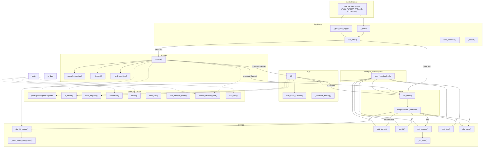

# `magnetics-code` — Architecture & Function Reference

Codebase map for `analysis/magnetics-code/`. Six Python modules implement a full
load → prep → fit → plot pipeline. `omfit_compat.py` is the foundation layer;
everything else builds upward from it.

---

## Module Dependency Graph

```
omfit_compat.py          ← foundation, no local imports
    ↑           ↑
io_data.py   prep.py   fit.py   plots.py
    ↑              ↑       ↑
              run.py  (orchestrator)
                  ↑
        example_154551.ipynb
```

Dependency detail:

| Module | Imports from (local) |
|--------|----------------------|
| `omfit_compat` | *(none)* |
| `io_data` | `omfit_compat` (resolve_channel_filter) |
| `prep` | `omfit_compat` |
| `fit` | `omfit_compat` |
| `plots` | `omfit_compat` |
| `run` | `io_data`, `prep`, `fit` |

---

## Data Flow Flowchart



---

## Module Reference

---

### `omfit_compat.py` — Foundation shim

Reimplements the OMFIT runtime symbols that `prep`, `fit`, and `plots` expect.
No local imports. Never touches MDSplus or a remote server.

| Function / Class | Signature | Role |
|-----------------|-----------|------|
| `printi(*args)` | `→ None` | Informational console print |
| `printv(*args)` | `→ None` | Verbose console print (same as printi locally) |
| `printw(*args)` | `→ None` | Warning print (prefixes "WARNING:") |
| `printe(*args)` | `→ None` | Non-fatal error print (prefixes "ERROR:") |
| `OMFITexception` | class | Local stand-in for OMFIT's exception class |
| `is_device(device, name)` | `→ bool` | Loose device-name comparison — normalises `DIII-D`/`DIIID`/`diii_d` etc. |
| `_delta_degrees_scalar(θ1, θ2)` | `→ float` | Angular arc from θ1→θ2, wrapped to ±180° |
| `delta_degrees` | vectorised `_delta_degrees_scalar` | Used in `fit.form_basis_function` for sensor extents |
| `cornernote(ax, device, shot, ...)` | `→ None` | Annotates the figure bottom-right with shot/device text |
| `uband(x, y, yerr, ax, ...)` | `→ (line,)` | Plots a line + shaded ±σ uncertainty band; returns `(line,)` for call-site compatibility |
| `device_data_dir(device)` | `→ str` | Path to `OMFIT-magnetics/DATA/<device>/` |
| `_extract_quoted(s)` | `→ list[str]` | Extracts all `'...'` tokens from a line (used for channel_filters.txt parsing) |
| `load_channel_filters(device)` | `→ dict[str, list[str]]` | Parses `channel_filters.txt` into `{name: [regex, ...]}` |
| `resolve_channel_filter(filter, device)` | `→ list[str]` | Maps a friendly name like `"Bp_LFS_midplane"` to its regex list; passes raw regexes through unchanged |
| `_parse_namelist_array(text)` | `→ ndarray` | Parses Fortran namelist numeric arrays (with `N*value` repeat syntax) |
| `load_wall(device)` | `→ (r, z)` | Reads the first-wall R-Z outline from `<device>.txt`; returns `(None, None)` if unavailable |

---

### `io_data.py` — Data loading

Replaces OMFIT's MDSplus fetch. Loads pre-saved netCDF files from
`analysis/data/<shot>/`. Returns typed `ShotData` bundles.

**Class:**

| Class | Fields | Notes |
|-------|--------|-------|
| `ShotData` | `shot`, `device`, `raw`, `plasma`, `coupling` | Dataclass bundle of the three input Datasets for one shot. `coupling` is `None` if no COUPLING file exists. |

**`raw` Dataset layout** (from OMFIT's `fetch_magnetics.py`):
- dims: `channel (192) × time (204800, seconds)`
- vars: `signal(channel, time)`, `signal_sigma(channel)`, plus geometry fields per channel:
  `r`, `z`, `phi`, `theta`, `tilt`, `length`, `delta_phi`, `na`, `pair`, and endpoint coordinates `*_end1` / `*_end2`
- attrs: `shot`, `device`, `sigma_type`

**`plasma` Dataset:** `Bt`, `Ip` on a millisecond time base; `helicity` attr.

**`coupling` Dataset:** `dc_coupling(coil, channel)` DC vacuum compensation matrix.

| Function | Signature | Role |
|----------|-----------|------|
| `_open(path)` | `→ xr.Dataset` | Tries `h5netcdf` then `netcdf4` engines; falls back to `_open_with_h5py` |
| `_open_with_h5py(path)` | `→ xr.Dataset` | Backend-free HDF5 loader using `h5py`; reconstructs xarray from dimension scales and DIMENSION_LIST refs |
| `_scalar(v)` | `→ scalar` | Unwraps length-1 arrays / bytes from HDF5 attrs |
| `load_shot(shot, data_root)` | `→ ShotData` | Main entry point. Loads RAW + PLASMA_PARAMS + (optional) COUPLING. Normalises channel names to plain strings. |
| `valid_channels(raw, channel_filter, device)` | `→ list[str]` | Returns channel names that match `channel_filter` and have non-NaN signal. Calls `omfit_compat.resolve_channel_filter`. |

---

### `prep.py` — Signal conditioning

Ports `SCRIPTS/prep_magnetics.py`. Transforms raw signal data through six
sequential steps. Called by `run.run_steps()` or directly.

**Entry point:**

```
prepare(shotdata, ...) → (prepared: xr.Dataset, plasma_trimmed: xr.Dataset)
```

The `prepared` Dataset carries `signal`, `signal_sigma`, geometry coordinates,
`signal_precon_u` (SVD left-singular vectors), `signal_precon_svals`, and attrs
`shot`, `device`, `helicity`, `signal_energy_limit`, `signal_effective_rank`.

| Function | Signature | Role |
|----------|-----------|------|
| `causal_gaussian(values, sigma, truncate)` | `→ ndarray` | One-sided Gaussian smoothing: output sample `n` is weighted average of samples `≤ n` only. Avoids acausal smearing of bdot spikes. Used directly by `prepare` for all filter modes. |
| `prepare(shotdata, channel_filter, time_trim, cutoff_hz, detrend_type, detrend_band, energy, integrate, dc_comp, dc_comp_coils, verbose)` | `→ (Dataset, Dataset)` | Orchestrates all six prep steps in order (see pipeline below). |
| `_detrend(ds, channels, detrend_type, detrend_band, _printv)` | `→ None (in-place)` | Dispatches to baseline / linear / endpoints detrend logic. Called by `prepare`. |
| `_svd_condition(ds, energy, _printv)` | `→ None (in-place)` | SVD of the `channel × time` data matrix. Stores singular vectors / values. Zeros out components below cumulative energy threshold. Keeps cos/sin pairs together. Called by `prepare`. |

**Six-step pipeline inside `prepare()`:**

```
1. Channel & time trim          (regex filter + time window)
2. DC vacuum compensation       (optional — uses COUPLING matrix)
3. Device-specific corrections  (e.g. 2019 DIII-D wiring swap for shot > 177705)
4. Integrate dB/dt → B         (optional)
5. Causal Gaussian filter       (lowpass / highpass / bandpass — auto-downsamples)
6. Detrend                      (_detrend)
7. SVD condition                (_svd_condition)
```

---

### `fit.py` — Spatial modal fit

Ports `SCRIPTS/fit_magnetics.py`. SLCONTOUR-style cylindrical-Fourier least-squares
fit across all sensor locations at every time slice.

**Entry point:**

```
fit(prepared, ...) → fit_ds: xr.Dataset
```

`fit_ds` adds to `prepared`: `fit_signal`, `fit_ns`, `fit_ms`, `fit_coeffs` (complex,
`mode × time`), `fit_sigmas`, `residual`, `chi_sq`, `red_chi_sq`, `basis` (design matrix A).
Attrs include `fit_basis`, `fit_geometry`, `fit_condition`, `raw_cn`, `eff_cn`, `condition_number`.

| Function | Signature | Role |
|----------|-----------|------|
| `form_basis_function(n, m, x1, x2, y1, y2, fit_basis)` | `→ complex ndarray` | Computes one column of the design matrix for mode `(n, m)`. Two modes: `"sinusoidal-point"` (evaluates sinusoid at sensor centre) or `"sinusoidal-integral"` (analytically averages over sensor angular extent). |
| `fit(prepared, ns, ms, channel_filter, fit_exclude, fit_basis, fit_geometry, fit_cond, verbose)` | `→ xr.Dataset` | Main entry: builds design matrix A via `form_basis_function`, SVD-conditions A to get condition number K and per-coeff error bars, calls `np.linalg.lstsq` across all time slices, reforms complex coefficients from real/imag pairs, computes chi². |
| `_condition_warning(K)` | `→ None` | Prints SLCONTOUR K-thresholds: warn if K > 10, error if K > 20. |

**Design matrix construction:**

Each mode `(n, m)` contributes 1 real column (if purely real) or 2 columns (real + imaginary).
Helicity sign convention is auto-corrected. Aliasing from equally-spaced probes is detected
and the mode collapsed to 1 component if ill-conditioned.

---

### `plots.py` — Visualisation

Ports the `PLOTS/*` scripts. Each function takes the Datasets from `prep`/`fit`
and an optional `ax` (or `axes`). Returns the axis/axes for further customisation.

| Function | Inputs | Output | Description |
|----------|--------|--------|-------------|
| `plot_sensors(raw, channel_filter, geometry, ax, device)` | `raw` Dataset | single `ax` | Sensor footprint map. Three geometry modes: `"rz"` (R-Z cross-section with wall), `"flat"` (phi vs z), `"cylindrical"` (phi vs theta). |
| `plot_signal(raw, prepared, channel_filter, ax, legend_maxnum)` | `raw` + `prepared` | single `ax` | Overlays PREPARED traces on RAW traces (raw shifted to match at t₀). Highlights channels with largest peak-to-peak variation. |
| `plot_fit(fit, axes, legend_maxnum)` | `fit` Dataset | 3 `axes` | 3-panel: (1) reduced chi² vs time (log), (2) all signals, (3) residuals with worst channels labeled. |
| `plot_fit_modes(fit, axes, legend_maxnum)` | `fit` Dataset | 2 `axes` | 2-panel: (1) amplitude ± 1σ, (2) phase ± 1σ for modes with appreciable amplitude. Uses `_amp_phase_with_errors`. |
| `plot_slice(fit, fix_coord, fix_value, ngrid, ax, trace_peak, **plot_kwargs)` | `fit` Dataset | `axm` | Classic SLCONTOUR contour: reconstructs field on spatial × time grid, pcolormesh. Optional RMS trace panel above. Peak location overlaid as dots. |
| `plot_svds(fit, axes)` | `fit` Dataset | 2 `axes` | SVD diagnostics: (1) data-matrix cumulative energy with threshold line, (2) design-matrix condition numbers with cutoff line. |

**Internal helpers:**

| Helper | Used by | Role |
|--------|---------|------|
| `_amp_phase_with_errors(coeff, sigma)` | `plot_fit_modes` | Propagates errors from complex coeff ± sigma → amplitude ± σ_amp and phase ± σ_phase |
| `_no_wrap(a)` | `plot_sensors` | Prevents mis-plotting of sensors that straddle the 0°/360° angle boundary |

---

### `run.py` — Orchestrator

Ports `SCRIPTS/run_magnetics.py`. Chains load → prep → fit into a single call.

**Class:**

| Class | Properties | Notes |
|-------|-----------|-------|
| `MagneticsRun` | `shotdata`, `prepared`, `plasma`, `fit` | Dataclass. Convenience properties: `raw` (→ `shotdata.raw`), `shot`, `device`, `condition_number` (→ `fit.attrs["condition_number"]`). |

| Function | Signature | Role |
|----------|-----------|------|
| `run_steps(shot, channel_filter, ns, ms, time_trim, prep_kwargs, fit_kwargs, data_root, verbose)` | `→ MagneticsRun` | Calls `load_shot → prepare → fit` and bundles all results. `prep_kwargs` / `fit_kwargs` are passed through as `**kwargs` to allow any parameter from those modules. |

---

### `example_154551.ipynb` — Usage example

Notebook demonstrating the full pipeline on DIII-D shot 154551.
Calls `run_steps()` and then each `plots.*` function to produce the full
suite of diagnostic figures.

---

## Call Graph (text form)

```
run_steps()
├── load_shot()                       [io_data]
│   ├── _open()
│   │   └── _open_with_h5py()         (fallback)
│   └── → ShotData(raw, plasma, coupling)
│
├── prepare()                         [prep]
│   ├── resolve_channel_filter()      [omfit_compat]
│   ├── is_device()                   [omfit_compat]   (wiring-fix check)
│   ├── causal_gaussian()             (lowpass / highpass / bandpass)
│   ├── _detrend()
│   └── _svd_condition()
│   └── → (prepared, plasma_trim)
│
└── fit()                             [fit]
    ├── resolve_channel_filter()      [omfit_compat]
    ├── form_basis_function()         (per mode per sensor)
    │   └── delta_degrees()           [omfit_compat]
    ├── is_device()                   [omfit_compat]
    ├── np.linalg.lstsq               (all time slices at once)
    ├── _condition_warning()
    └── → fit Dataset

─── Plotting (called by notebook / user) ────────────────────────
plot_sensors(raw)
├── resolve_channel_filter()          [omfit_compat]
├── load_wall()                       [omfit_compat]
├── _no_wrap()
└── cornernote()                      [omfit_compat]

plot_signal(raw, prepared)
└── cornernote()                      [omfit_compat]

plot_fit(fit)
└── cornernote()                      [omfit_compat]

plot_fit_modes(fit)
├── _amp_phase_with_errors()
├── uband()                           [omfit_compat]
└── cornernote()                      [omfit_compat]

plot_slice(fit)
└── cornernote()                      [omfit_compat]

plot_svds(fit)
└── (no compat calls — pure matplotlib + numpy)
```

---

## Key Data Contracts

| Dataset | Produced by | Consumed by | Key variables |
|---------|------------|-------------|---------------|
| `raw` | `io_data.load_shot` | `prep.prepare`, `plots.plot_sensors`, `plots.plot_signal` | `signal(channel,time)`, `signal_sigma`, geometry (`r`,`z`,`phi`,`theta`,`*_end1/2`) |
| `plasma` (trimmed) | `prep.prepare` | `run.MagneticsRun` (stored, passed to user) | `Bt`, `Ip` vs time (ms), `helicity` attr |
| `prepared` | `prep.prepare` | `fit.fit`, `plots.plot_signal`, `plots.plot_svds` | `signal` (conditioned), `signal_precon_u`, `signal_precon_svals`, geometry coords, attrs `helicity`, `signal_effective_rank`, `signal_energy_limit` |
| `fit` | `fit.fit` | all `plots.*` | All of `prepared` plus `fit_signal`, `fit_coeffs(mode,time)`, `fit_sigmas(mode,time)`, `fit_ns`, `fit_ms`, `residual`, `chi_sq`, `red_chi_sq`, `basis`, attrs `condition_number`, `fit_basis`, `fit_geometry`, `fit_condition` |
